# Configuration Steps

- [Configuration Steps](#configuration-steps)
  - [Configure PLC project in TIA Portal](#configure-plc-project-in-tia-portal)
  - [Configure PLC Connections in Industrial Edge](#configure-plc-connections-in-industrial-edge)
    - [Configure Databus](#configure-databus)
    - [Configure PLC Connectors](#configure-plc-connectors)
  - [Configure IIH Essentials](#configure-iih-essentials)
    - [Configure the adapter](#configure-the-adapter)
    - [Configure an asset with variables](#configure-an-asset-with-variables)
  - [Configure Performance Insight](#configure-performance-insight)
    - [Defining Limits](#defining-limits)
    - [Show step time analysis](#show-step-time-analysis)

In order to set up the 'Step Time Analysis' dashboard within the Performance Insights application, it is essential to understand the flow of data across the system. The following diagram illustrates how data is communicated from the PLCs to the Industrial Edge Device, and subsequently processed by the Edge applications:

To achieve this data flow, the following configurations will be explained:

1. **OPC UA Connector**: Configure the OPC UA Connector to establish communication with PLC 1 and PLC 2. Ensure that the OPC UA servers on these PLCs are set up to allow for data exchange.

2. **S7 Connector**: Set up the S7 Connector to facilitate data transfer from PLC 3 using the S7+ protocol, and from PLC 4 and PLC 5 via the standard S7 protocol.

3. **Databus Configuration**: Integrate the MQTT-Broker to allow for a seamless data flow from the OPC UA and S7 Connectors to the higher-level Industrial Edge Applications.

4. **Common Configurator**: It serves as the initial configuration point to ensure that data is correctly identified and tagged for use by other applications, like IIH Essentials and Performance Insights.

5. **IIH Essentials**: Install and configure the IIH Essentials application to ensure that the core industrial data from your PLCs can be effectively harnessed and utilized by the Edge Device. This setup is crucial for enabling comprehensive data collection and subsequent analysis within the Performance Insights application.

6. **Performance Insights Application Setup**: Within the Performance Insights application, configure the 'Step Time Analysis' feature by linking it to the respective asset models, which reflect the status of the sequential control steps from the PLCs.

## Configure PLC project in TIA Portal
This use case contains a TIA project which simulates the process. The project also inclundes a HMI visualization to operate the demonstration process. Download the TIA Portal project [here](../src/StepTimeAnalysis_20221129_1438.7z). The first steps are to configure the PLC project and the intruduction into the HMI screens.

1.	Open TIA portal and open the project containing the car production application (Adapt the PLC type and IP addresses to your system for each PLC and HMI)

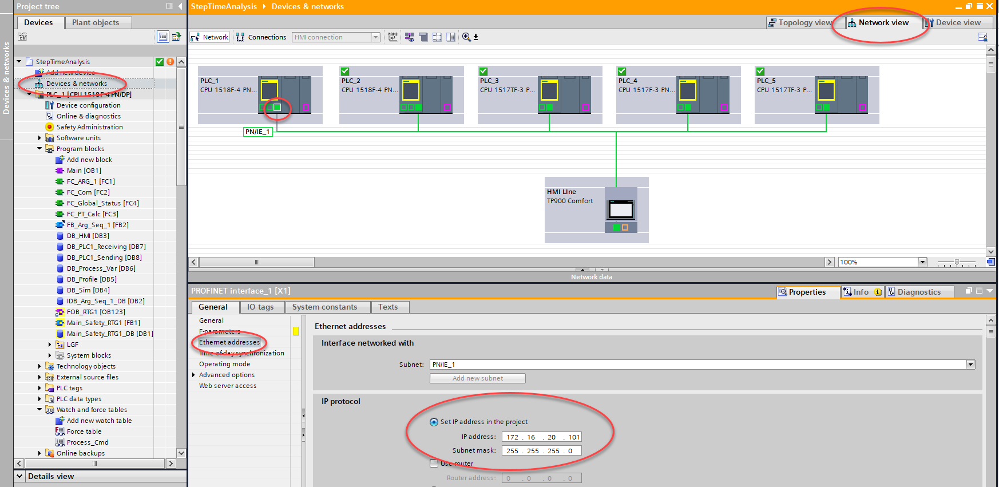

2.	Download the PLC program to the PLCs and set the PLCs into RUN
3.	Open the HMI to control the car production application

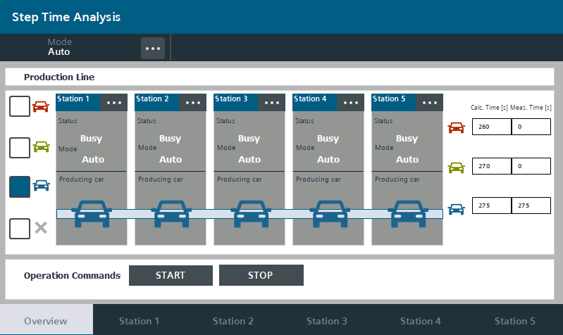

Global Screen:
* Switch between automatic and manual mode of the stations
* Select which car type should be produced
* See which car type is actually in production in each station
* Check status of the stations
* See the calculated and measured production time for each car type
* Start and stop the sequential control system in the stations
* Switch to the screens for every station 

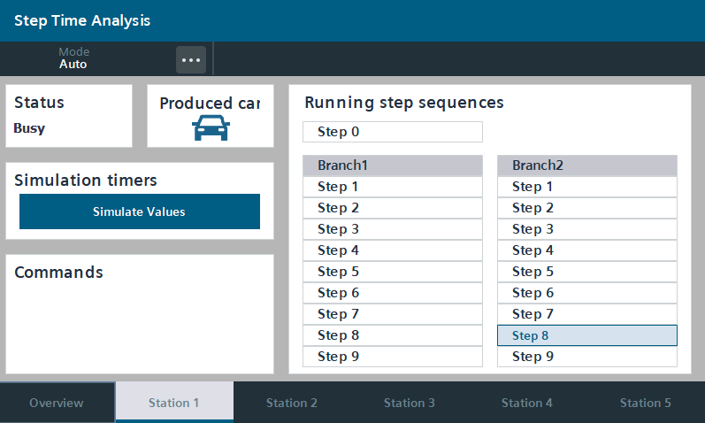

Station Screen:
* Switch between automatic and manual mode for the selected station (Only when status is Idle)
* Select the car type with the dropdown menu in manual mode
* After selecting the car type start the sequential control
* Stop and reset the sequential control
* See the status of the station
* See the car type in the station in automatic mode
* Switch to the delay select screen ("Simulate values")

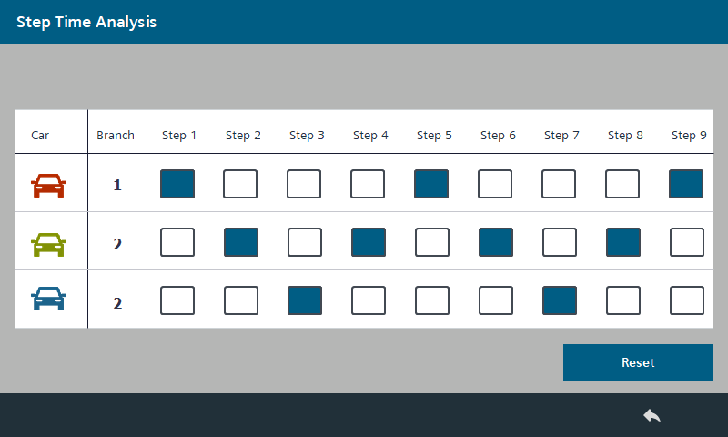

Delay Select Screen:
* Reachable via button “Simulate values” on each station
* Select which step time should be delayed
* When the step is selected, a random time between 0 and 10 seconds is added to the step

## Configure PLC Connections in Industrial Edge

We are now switching to the Edge part of this use case. Each of the following steps are done in the Industrial Edge system and, as explained in the Data Flow picture [above](#flow-data).

In order to build this infrastructure, first, these apps must be configured correctly:

* Databus
* Common Configurator

### Configure Databus

Go to the *Industrial Edge Management UI > Data Connections*, select "Databus" and launch it on the onboarded Edge Device.

When the configurator is open, click on the "plus" icon in the red square shown in the picture bellow to add an user: 

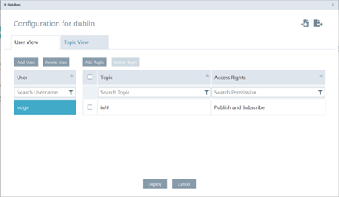

Add an user with the topic: `ie/#`. In this use case we use the credentials "edge" / "edge". The credentials can be chosen freely but must be the same in all system apps. Select "Publish and Subscribe" as permission. And lastly, click "add"

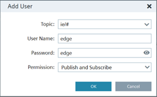

Then, just click **Deploy** to apply the changes:

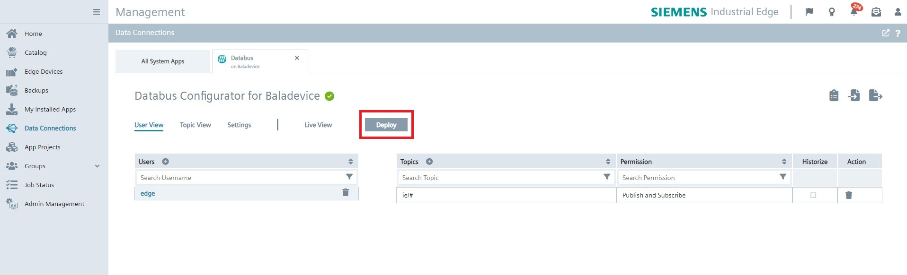

### Configure Common Configurator

In this part, the OPC UA Connector and S7 Connector are set-up from the Common configurator, but first Databus needs to be configured on Common Configurator.

Go to *Edge Device UI > Apps*, click on Common Configurator to open the app and go to *Settings > Databus Credentials*, type the credentials for "Data Publisher Settings" and "Data Subscriber Settings" and click **save**. Now, the Databus is configured on the Common Configurator.

IMAGEN

Now, it's time to set-up the OPC UA Connector on Common Configurator. To achive this, go to *Get Data > Connector Configuration*. In this tab the followings conditions must appear:

* OPC UA Connector with green circle (indicating good status).
* "Databus is installed" next to a green checkmark (indicating connection with Databus)

IMAGEN

If those conditions are not shown, please revisit and repeat the reading process starting from this point.

Click on the OPC UA Connector and click "Tags". Here the data sources (PLC1 and PLC2) are defined in order to extract data from them:

IMAGEN

Select "Add Data Source" to add the PLC1 and type the device data, like so:

IMAGEN

Then just click **save** and the data source is added:

IMAGEN

Now, in order to add the needed tags, just click on "Actions" on the data source, select *Browse Tags > Start Browsing*, select the needed tags and click on "".

## Configure IIH Essentials

Steps are created for an asset as aspects in IIH Essentilas and automatically applied in Performance Insight. An asset represents, for this example, a car production "Station". and for each asset the aspects represents the steps. 

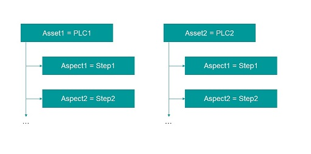

Performance Insight use this structure of assets and aspects to visualize the data in a later step. Open the web interface of your IED and launch the Data Service app. 

### Configure the Databus

Firstly, Databus needs to be configured on IIH Essentials. To do that go to *Edge Device UI > Apps*, open IIH Essentials and go to *Settings > Databus Settings*, click on the edit icon:

IMAGEN 

Enter the needed data and click **save**.

### Configure the Connectors

Secondly, connectors need to be configured on IIH Essentials. To achive this, go to *Connectors* tab and select the available connectors on the left, for this case, SIMATIC S7 Connector and the OPC UA shoud be available. Click the edit icon on the top right to open the connector configuration tab and switch the "Status" to active.

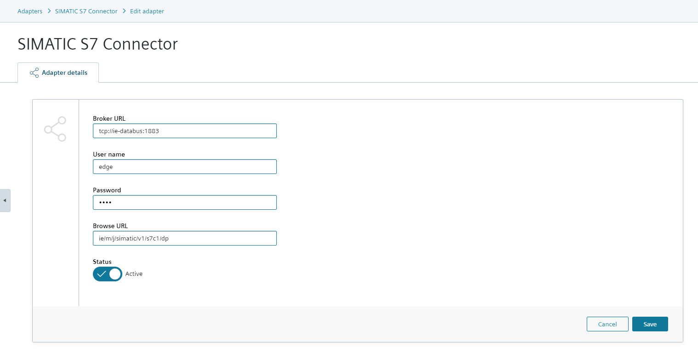

Add the missing entries for username and password (again "edge"/"edge") and save it.

Repeat this step for the OPC UA Connector.

### Configure an asset with variables

Click on the icon "Assets & Connectivity" on the left bar. Add a child asset for the main "edge" asset. Into this child asset add 5 subassets for the stations.

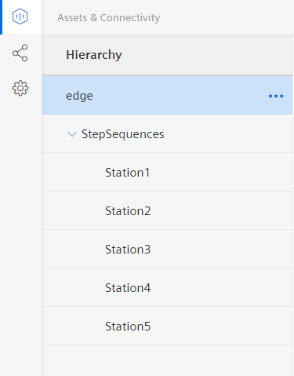

Create an aspect for every step. The first step of each branch (step 2 and step 11) must be configured as initial step. This is necessary to mark the beginning of the sequence and to link the corresponding product for the branch.

First step of the branch:

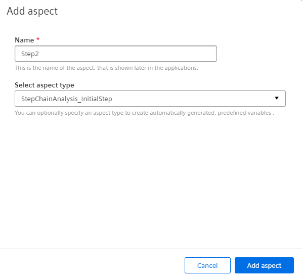

Following steps of the branch:

Link the variables that have been created by adding the aspects to the corresponding Connector tags.

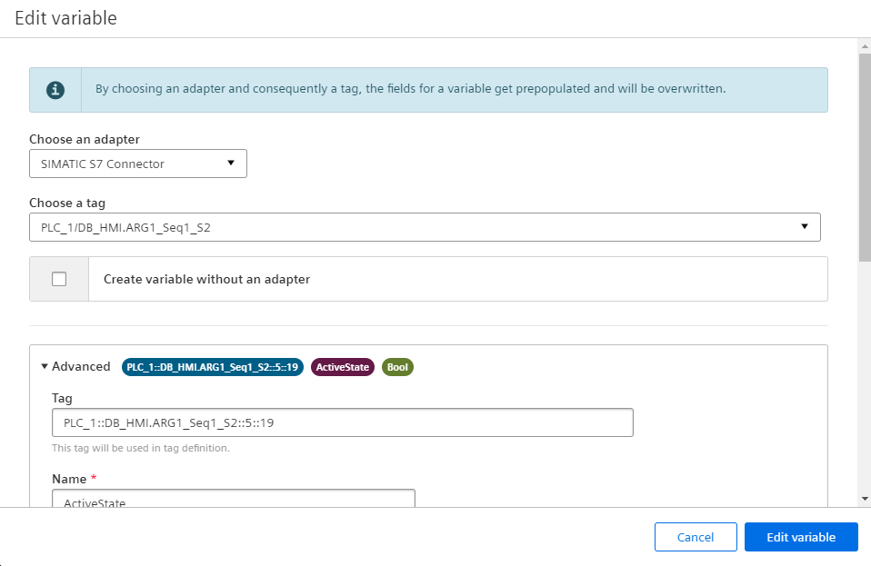

Repeat this process for every station.

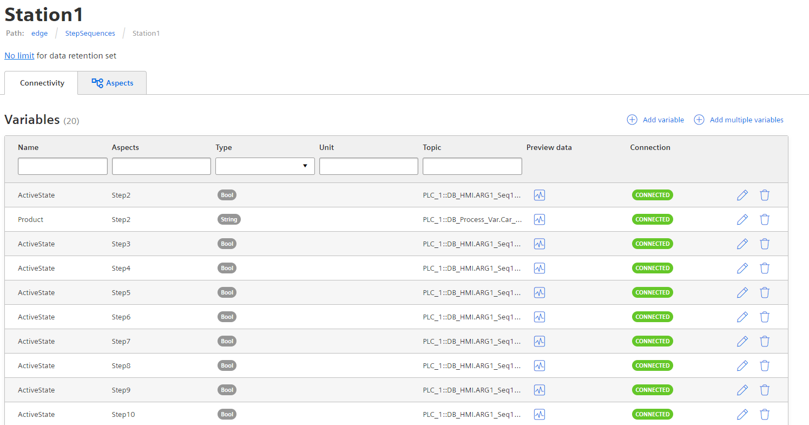

## Configure Performance Insight

After finishing the configuration of the Data Service, open the Performance Insight application on the IED. With this appliation it is possible to get information about the duration of defined steps and observe limits of individual steps and sequences.

The asset structure that was created in Data Service can also be found in Performance Insight. The next step is to specify the limits for each step in the asset configuration.

### Defining Limits

If no Step time analysis has yet been configured in Performance Insight, the "Define Limits" button is visible. Click on the button.

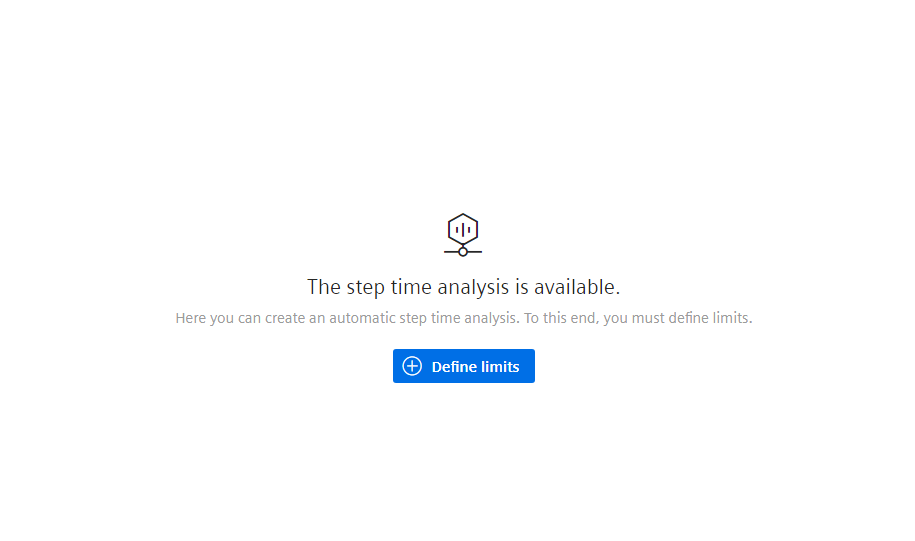

To change the limits for the steps in the sequential control system, click on the gear icon on the right.

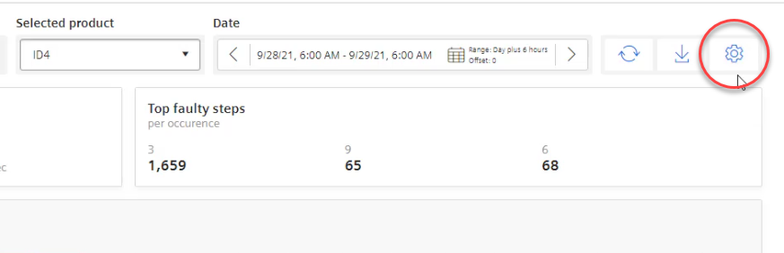

Choose a product from the list of available products. Click on the gear icon of the product. 

A list with all steps of this product is displayed. Open the dropdown menu with the text "Apply to all step limits". Specify a percentage (e.g. 5%) that is added to the initial value and click Apply. A limit is calculated for all steps based on the respective limits and entered in the "Planned step time limit" column.

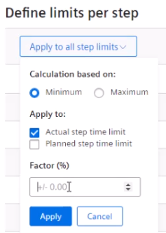

The time limits are set in the fields. Click the "Save" button.

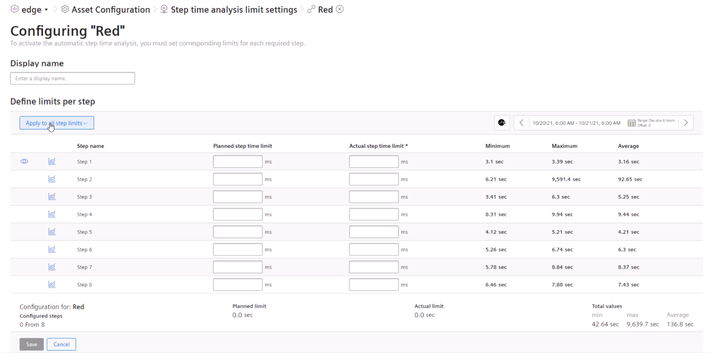

### Show step time analysis

When you have created steps for the asset in the Data Service and when you have defined the limits then the step time analysis is automatically 
displayed in the "Step time analysis" dashboard.

With the help of the "Overview" screen you can get all information about the sequences of a specific product for a specified time period. When the step is gray the step time is within the defined limits. A step displayed in red is outside the defined limits.

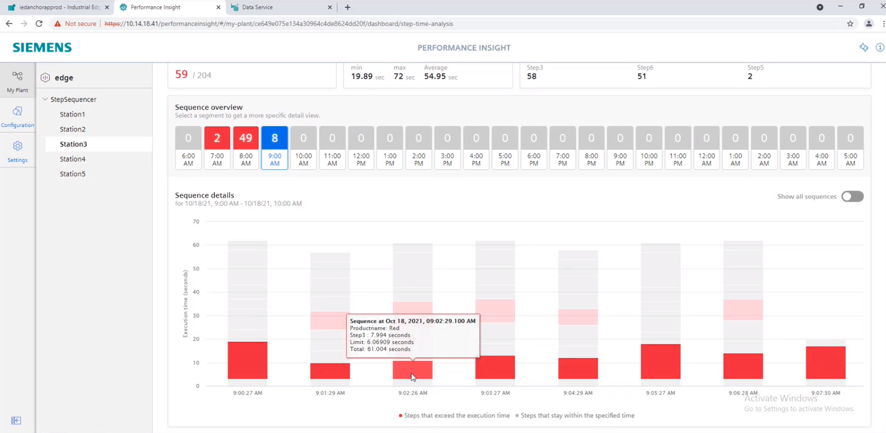

The analysis overview is displayed in the "Step time analysis" dashboard with the following options:
* Switching to the trend view
* Displaying the number of faulty sequences
* Execution time of the faulty sequences
* Selecting a product for which the step time analysis is to be displayed
* Selecting a time period for which the step time analysis is to be displayed
* Downloading a report in CSV format
* Switching to the limit definition in the Asset Configuration
* Displaying the steps with highest fault rate
* Sequence overview: Display and selection of a specific sequence for detailed display
* "Show all sequences"
* Sequence details: Displaying all sequences in the selected time period and defined steps. When selecting a single step, the Trend view of the step opens.
